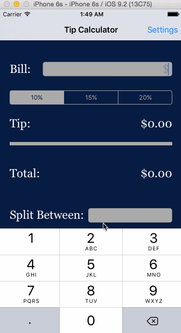
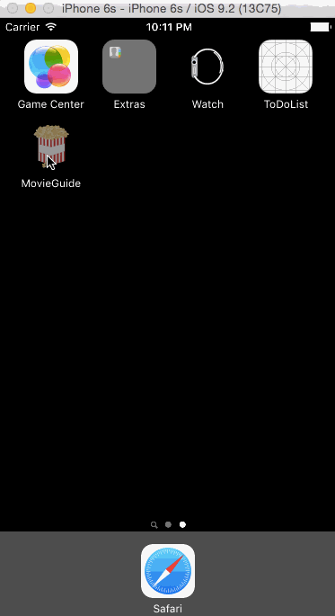
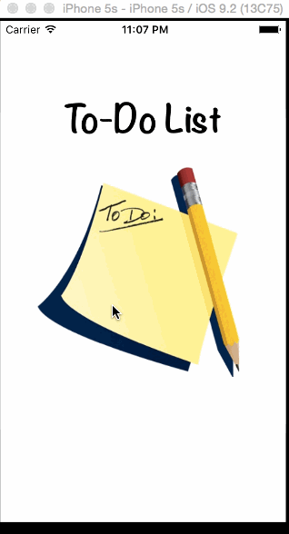

# Portfolio
A collection of some of the projects I've been working on.

##Demo:
###Extra Tips
An iOS app that calculates the tip of a bill amount, written as a prework for CodePathUniversity.

###Movie Guide
A movie guide app that displays an overview of movies currently in theaters; written in Swift as a tutorial project for MobileSpace.

###To-Do List
A simple to-do list app written in Swift as a tutorial project for MobileSpace.
