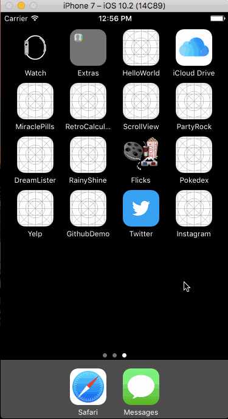
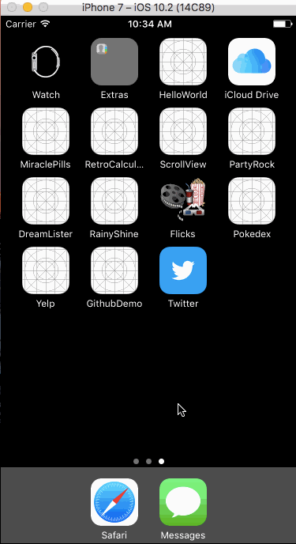
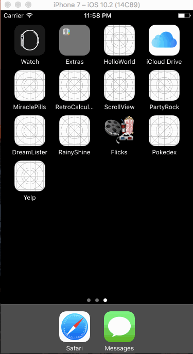
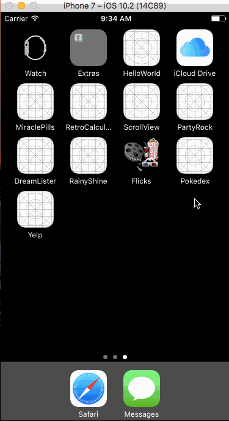
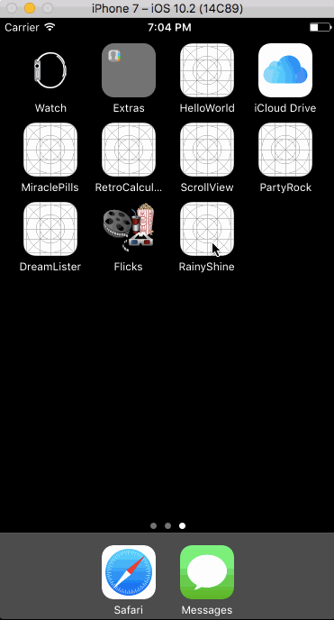

# Demo:
### [Cookery](https://github.com/SangSaephan/furry-adventure)
A recipe by ingredients app; written in Swift as the final project for CodePath.

### [Instagram](https://github.com/SangSaephan/CodePath-Instagram)
A photo sharing app using Parse as its backend; written in Swift as a tutorial project for CodePath.

### [Twitter](https://github.com/SangSaephan/CodePath-Twitter)
A basic Twitter app to read and compose tweets using the Twitter API; written in Swift as a tutorial project for CodePath.

### [Yelp](https://github.com/SangSaephan/CodePath-Yelp)
A Yelp search app using the Yelp API; written in Swift as a tutorial project for CodePath.

### [Pokedex](https://github.com/SangSaephan/Pokedex)
An app that displays a list of Pokemon, along with their information (e.g. bio and attack moves); written in Swift as a tutorial project for Devslopes.

###[ Rainy Shine](https://github.com/SangSaephan/RainyShine)
An app that displays the current weather, as well as the next nine days, based on the user's location; written in Swift as a tutorial project for Devslopes.

### [Flicks](https://github.com/SangSaephan/CodePath-Flicks)
A movies app using the The Movie Database API; written in Swift as a tutorial project for CodePath.

### [Dream Lister](https://github.com/SangSaephan/RetroCalculator)
An app that displays a list of things you've always dreamed of having; written in Swift as a tutorial project for Devslopes.

### [Retro Calculator](https://github.com/SangSaephan/RetroCalculator)
A retro-style calculator; written in Swift as a tutorial project for Devslopes.

### [Extra Tips](https://github.com/SangSaephan/CodePath-ExtraTips)
An iOS app that calculates the tip of a bill amount, written as a prework for CodePathUniversity.

### [Movie Guide](https://github.com/SangSaephan/MovieGuide)
A movie guide app that displays an overview of movies currently in theaters; written in Swift as a tutorial project for MobileSpace.

- [Published on App Store](https://itunes.apple.com/us/app/movies-101/id1178902071?ls=1&mt=8)

### [To-Do List](https://github.com/SangSaephan/To-Do-List)
A simple to-do list app written in Swift as a tutorial project for MobileSpace.

