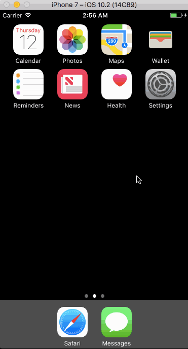
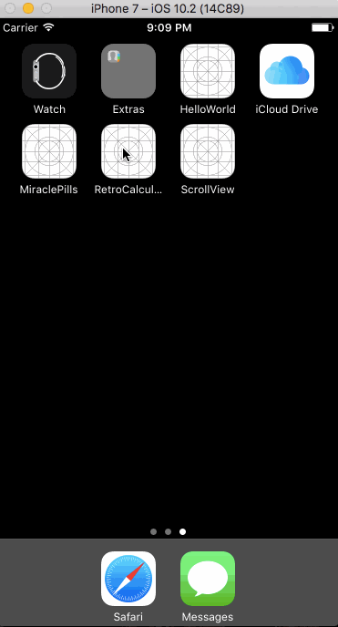

#Demo:
###[Flicks](https://github.com/SangSaephan/CodePath-Flicks)
A movies app using the The Movie Database API; written in Swift as a tutorial project for CodePath.

###[Dream Lister](https://github.com/SangSaephan/RetroCalculator)
An app that displays a list of things you've always dreamed of having; written in Swift as a tutorial project for Devslopes.

###[Retro Calculator](https://github.com/SangSaephan/RetroCalculator)
A retro-style calculator; written in Swift as a tutorial project for Devslopes.

###[Extra Tips](https://github.com/SangSaephan/CodePath-ExtraTips)
An iOS app that calculates the tip of a bill amount, written as a prework for CodePathUniversity.

###[Movie Guide](https://github.com/SangSaephan/MovieGuide)
A movie guide app that displays an overview of movies currently in theaters; written in Swift as a tutorial project for MobileSpace.

- [Published on App Store](https://itunes.apple.com/us/app/movies-101/id1178902071?ls=1&mt=8)

###[To-Do List](https://github.com/SangSaephan/To-Do-List)
A simple to-do list app written in Swift as a tutorial project for MobileSpace.

